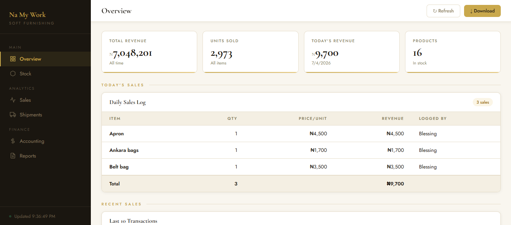
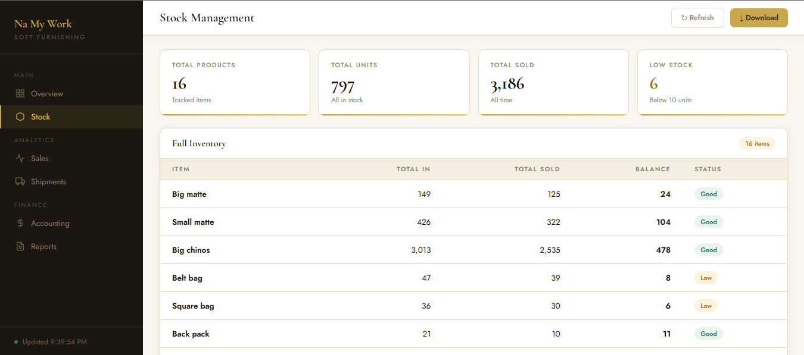
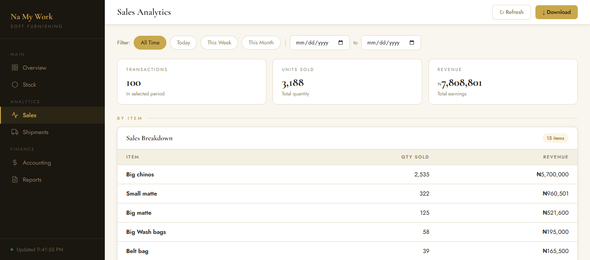
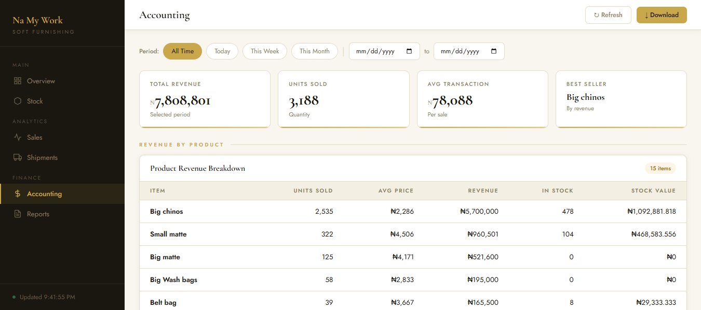
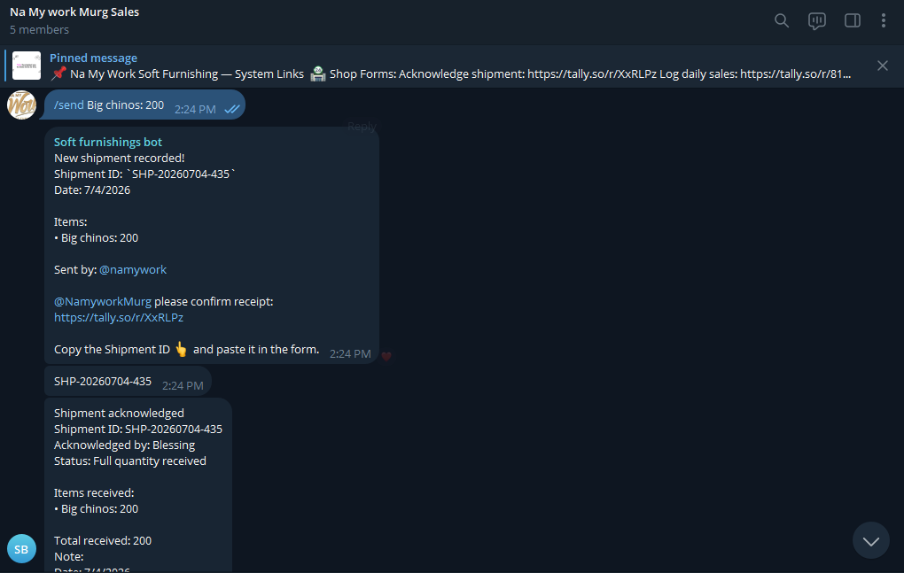
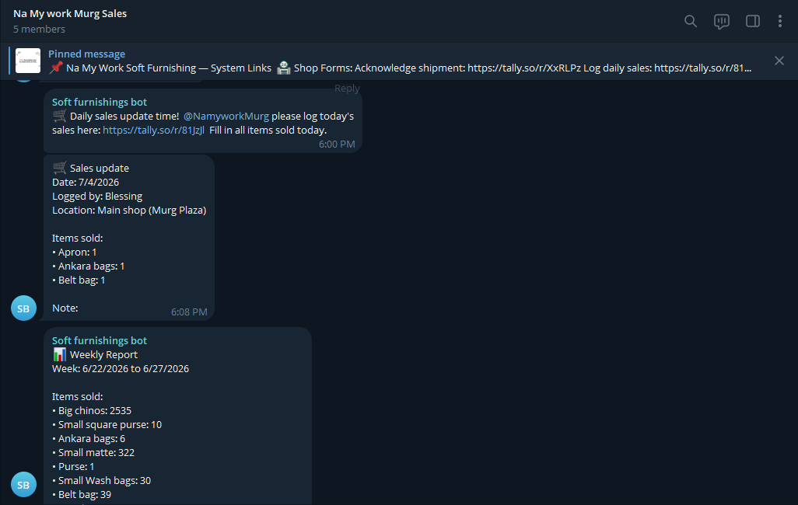
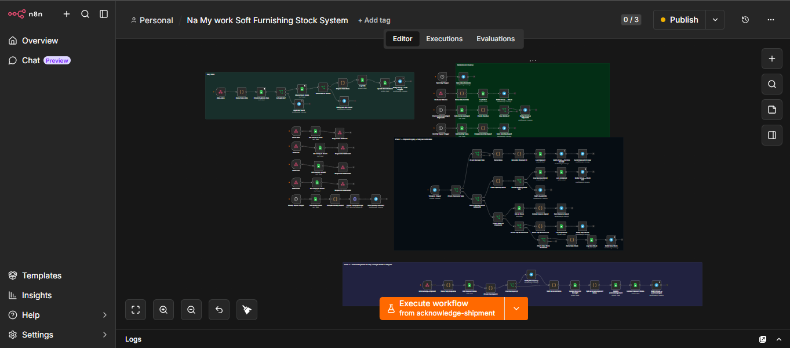
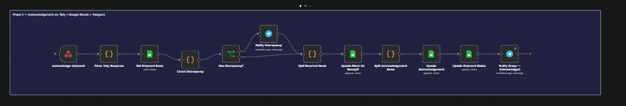

# Na My Work — Stock Management Automation System

A full production automation system built for a soft furnishing business to track stock movement between factory and shop, log daily sales, manage shipments and generate automated reports — all through Telegram, Google Sheets and a live dashboard.

> **Status: Live in production** — currently running for a real business in Abuja, Nigeria.

---

## The Problem

A soft furnishing business had a factory sending goods to a shop with zero accountability:
- The shop could deny receiving items
- Nothing was tracked or recorded
- Stock was going missing with no paper trail
- Monthly stock taking was a nightmare
- No visibility for the owner or accountant

## The Solution

A fully automated stock management system built with **n8n**, **Telegram**, **Google Sheets** and **Tally** that handles the entire workflow from shipment to sale — automatically.

---

## Live Demo

🔗 **Dashboard:** [namywork-dashboard-production.up.railway.app](https://namywork-dashboard-production.up.railway.app)

---

## Screenshots

### Dashboard — Overview


### Dashboard — Stock Management


### Dashboard — Sales Analytics


### Dashboard — Accounting


### Telegram Bot — Shipment Notification


### Telegram Bot — Sales Update


### n8n — Shipment Workflow


### n8n — Acknowledgement Workflow


---

## Features

### Factory Side (Manager)
| Command | Description |
|---|---|
| `/openingstock [PIN]` | Record opening stock — done once at system launch |
| `/send [item]:[qty], [item]:[qty]` | Send shipment from factory to shop |
| `/newstock [item]:[qty]` | Add new stock to factory inventory |
| `/balance` | Check live stock levels for all products |
| `/adjust [item]:[qty] [reason]` | Correct stock up or down with reason |

### Shop Side (Shop Person)
- **Acknowledge shipments** — via Tally form with per-item confirmation
- **Log daily sales** — dropdown selection prevents spelling mistakes
- **Log customer returns** — stock automatically restored
- **Discrepancy reporting** — if quantities don't match, manager gets instant alert

### Automated
- ✅ Unique shipment ID generated for every shipment
- ✅ Discrepancy detection — alerts manager when received qty doesn't match sent qty
- ✅ Escalation reminders — if shipment unacknowledged after 2 hours
- ✅ 6pm daily sales reminder to shop person
- ✅ Weekly report every Saturday at 8pm
- ✅ Monthly report on 1st of every month
- ✅ Live dashboard auto-refreshes every 2 minutes

### Dashboard (6 Pages)
- **Overview** — today's sales, recent activity, key metrics
- **Stock** — full inventory with Good/Low/Critical status
- **Sales** — filter by today, week, month or custom date range
- **Shipments** — all shipments with acknowledgement status
- **Accounting** — revenue per product, daily/weekly/monthly breakdown
- **Reports** — download branded PDF reports (daily, weekly, monthly)

---

## Tech Stack

| Tool | Purpose |
|---|---|
| **n8n** | Workflow automation engine |
| **Telegram Bot API** | Commands, notifications and alerts |
| **Google Sheets** | Database — stock ledger, sales, shipments |
| **Tally** | Form builder for acknowledgements and sales |
| **Railway** | Hosting for n8n and dashboard |
| **JavaScript** | Custom parsing logic in n8n Code nodes |
| **jsPDF** | PDF report generation in dashboard |

---

## System Architecture

```
Manager types /send in Telegram
         ↓
n8n Telegram Trigger
         ↓
Role check → Parse items → Generate Shipment ID
         ↓                        ↓
Log to Google Sheets      Tag shop person with Tally link
         ↓
Shop person fills acknowledgement form
         ↓
n8n Webhook catches submission
         ↓
Check discrepancy → Update stock → Notify group
         ↓
Shop person logs daily sales via Tally form
         ↓
Stock balance updates → Sales logged → Telegram notification
         ↓
Scheduled reports → Weekly & Monthly → Owner & Accountant
```

---

## Google Sheets Structure

| Tab | Purpose |
|---|---|
| Stock Ledger | Every stock movement — in, out, adjustments, returns |
| Summary | Live balance per product (SUMIF formulas) |
| Shipments | All shipments with acknowledgement status |
| Acknowledgements | Per-item acknowledgement records |
| Sales | Every sale with price and revenue |
| Accounting | Revenue breakdown per product |
| Pricing | Unit prices and low stock thresholds |
| Config | System settings — PIN, initialized flag |

---

## n8n Workflows

| Workflow | Purpose |
|---|---|
| Phase 1 — Shipment | Handles /send, /openingstock, /balance, /adjust, /newstock commands |
| Phase 2 — Acknowledgement | Processes Tally form submissions, updates stock and shipment status |
| Phase 3 — Daily Sales | Sales logging, 7pm reminder, weekly report, monthly report, escalation |
| Customer Returns | Handles return form submissions |
| Dashboard API | 4 GET endpoints serving live data to the dashboard |

---

## Dashboard Setup

The dashboard is a single HTML file served via Express on Railway.

```bash
# Install dependencies
npm install

# Start server
npm start
```

The dashboard fetches data from 4 n8n webhook endpoints:
- `/webhook/stock-data` — Summary tab
- `/webhook/sales-data` — Sales tab
- `/webhook/accounting-data` — Accounting tab
- `/webhook/shipments-data` — Shipments tab

---

## Key Design Decisions

**Why Telegram over WhatsApp?**
Telegram bots are free and have a powerful API. WhatsApp requires a paid Business API. For a small business this was the right trade-off.

**Why Google Sheets over a database?**
The owner and accountant are already comfortable with spreadsheets. Google Sheets gives them direct access to the data without needing a separate tool. SUMIF formulas handle the aggregation automatically.

**Why Tally over custom forms?**
Tally is free, mobile-friendly and has native webhook support. Building custom forms would have added unnecessary complexity.

**Why n8n over Zapier/Make?**
n8n is self-hosted which means no per-task pricing. For a system running hundreds of automations per month this saves significant cost.

---

## Results

- ✅ Zero unaccounted shipments since launch
- ✅ Full stock visibility for owner and accountant
- ✅ No manual spreadsheet work
- ✅ Discrepancies caught and flagged automatically
- ✅ Monthly stock taking reduced from hours to minutes
- ✅ Running 24/7 with ~$5/month hosting cost

---

## About

Built by **Muyideen Saka** — AI Agent Developer & Automation Engineer based in Abuja, Nigeria.

I build intelligent automation systems that eliminate manual work, scale with your business and deliver real results.

- 📧 Muyideensaka981@gmail.com

---

## License

This project is shared for portfolio purposes. The live system and credentials are not included in this repository.
